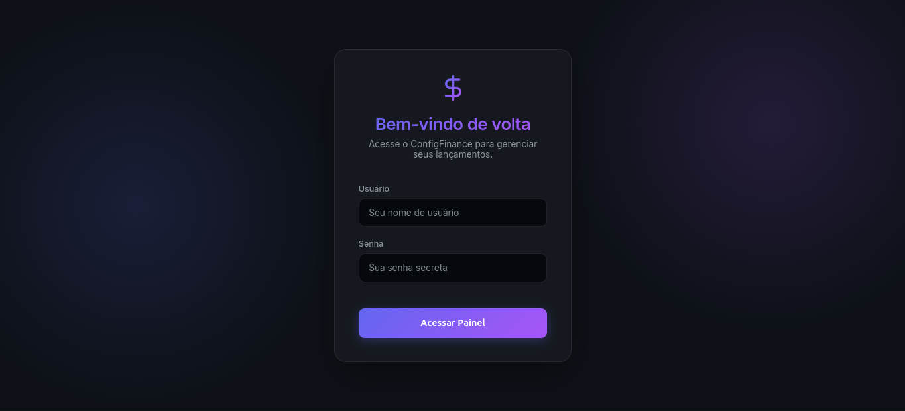
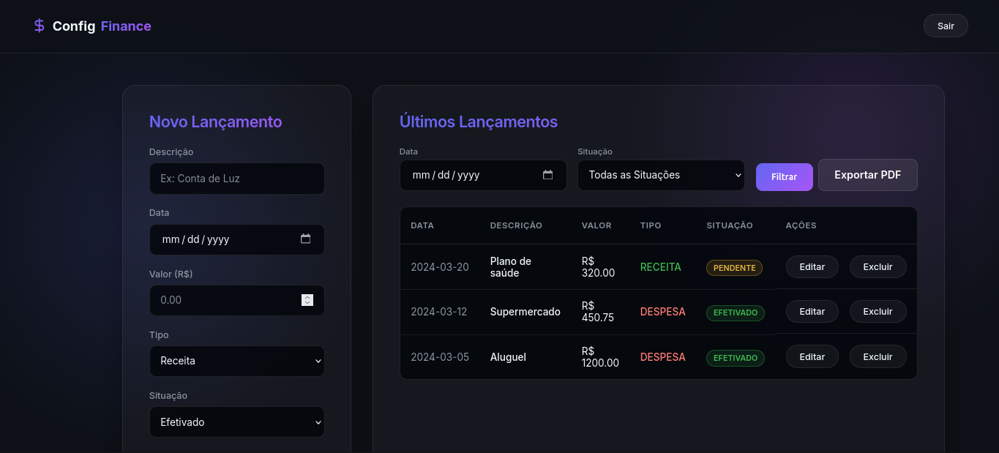

# ConfigFinance

A configuration management system built with Python, Flask, and PostgreSQL. It features a fully responsive Glassmorphism UI, a comprehensive PyTest automation suite, dynamic data filtering, PDF generation, and an automated environment provisioner.

## 🏛️ Architecture

The application is built on a standard **Client-Server Architecture**:
- **Backend**: A python-based Flask application that handles HTTP routing, session management, and server-side request processing.
- **Database Layer**: A raw SQL execution layer utilizing `psycopg2`. Connection instances are managed securely and strictly separated into service modules (`services/lancamentos_service.py` and `services/usuario_service.py`) conforming to the Service Pattern design.
- **Frontend**: Server-rendered Jinja2 HTML templates paired with a Vanilla CSS design system enforcing a premium Dark Mode aesthetic with dynamic interactive modals.
- **Testing Layer**: A unit testing suite powered by `pytest` and `pytest-mock`, testing application integration by securely intercepting the `psycopg2` pipeline without touching live environments.

## 🛠️ Tech Stack

- **Python 3.12**
- **Flask** (Web Framework & Session Management)
- **PostgreSQL** (Relational Database)
- **psycopg2-binary** (Postgres Adapter)
- **WeasyPrint** (HTML to PDF Exporter)
- **pytest & pytest-mock** (Testing Utilities)
- **python-dotenv** (Environment Configuration)
- **Vanilla CSS3 & HTML5** (Glassmorphism UI, Flexbox, CSS Grid)

## 📌 Routes and Capabilities

| Method | Endpoint | Description |
|---|---|---|
| `GET` | `/` | Redirects authenticated users to the dashboard. Redirects guests to login. |
| `GET` | `/login` | Renders the authentication interface. |
| `POST` | `/login` | Validates credentials against MD5 database hashes. |
| `GET` | `/lancamento` | Dashboard displaying the finance table, optional query parameters (`?data=` & `?situacao=`), and the new entry form. |
| `POST` | `/lancamento` | Processes and persists a new finance entry to the PostgreSQL database. |
| `GET` | `/exportar_pdf` | Converts current Dashboard variables into a downloadable `.pdf` report utilizing WeasyPrint. |
| `GET` | `/editar_lancamento/<id>` | Forces the server to render a centralized edit modal injected dynamically over the Dashboard interface. |
| `POST` | `/editar_lancamento/<id>` | Updates the values of the specific postgres row. |
| `GET` | `/deletar_lancamento/<id>` | Provides immediate database purging capabilities routing users back efficiently. |
| `GET` | `/logout` | Clears the Flask session and routes the user back to `/login`. |

## 🚀 Getting Started

### Prerequisites
- Operating System: Linux (Debian/Ubuntu recommended) or macOS
- Standard bash terminal
- Important libraries for WeasyPrint functionality: `libcairo2`, `libpango-1.0-0`, `libpangocairo-1.0-0` installed organically on Linux environments.

### Installation

1. **Clone the repository:**
   ```bash
   git clone https://github.com/DanielCorbellini/task2-configurationManagment.git
   cd task2-configurationManagment
   ```

2. **Configure the Environment:**
   Create a `.env` file in the root directory by copying the example provided:
   ```bash
   cp .env.example .env
   ```
   *Note: Ensure you set a random `SECRET_SESSION_KEY` inside `.env` to allow Flask sessions to work securely.*

3. **Automated Setup:**
   Run the provided Bash script to automatically install Python, PostgreSQL, configure the virtual environment, install `pip` packages, and populate the database via `dump.sql`.
   ```bash
   bash setup.sh
   # If permission is denied: chmod +x setup.sh && ./setup.sh
   ```

4. **Start the Application:**
   Run the built-in Flask development server using the newly created virtual environment:
   ```bash
   venv/bin/python app.py
   ```

### 🧪 Running the Pytest Suite
The repository includes exactly 21 testing configurations testing both web responses and postgres methods automatically.
1. Activate your local virtual environment: `source venv/bin/activate`
2. Run Pytest specifying the target directory: `python -m pytest tests/ -v`

### Accessing the App
Open your web browser and navigate to:
[http://0.0.0.0:5000](http://0.0.0.0:5000) or [http://localhost:5000](http://localhost:5000)

### Screenshots

Login Page:


Dashboard Page:


**Note**: This doesn't represent the final version of the project, it was made for academic purposes and it will be updated soon.